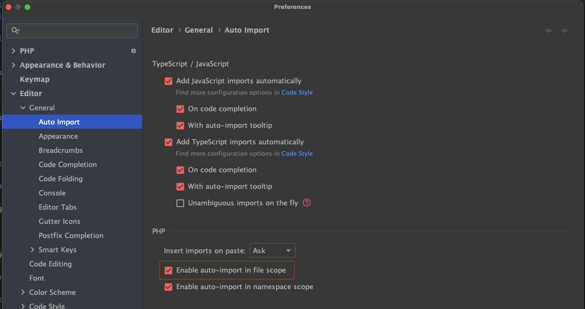
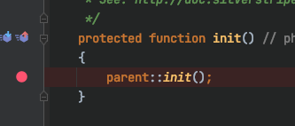
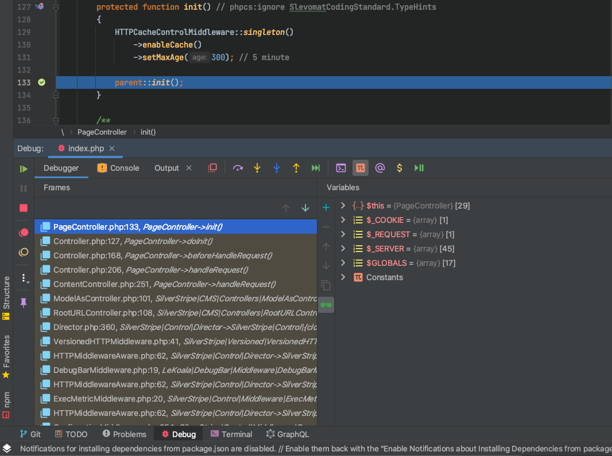
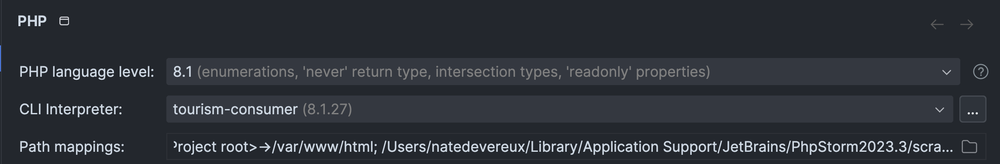
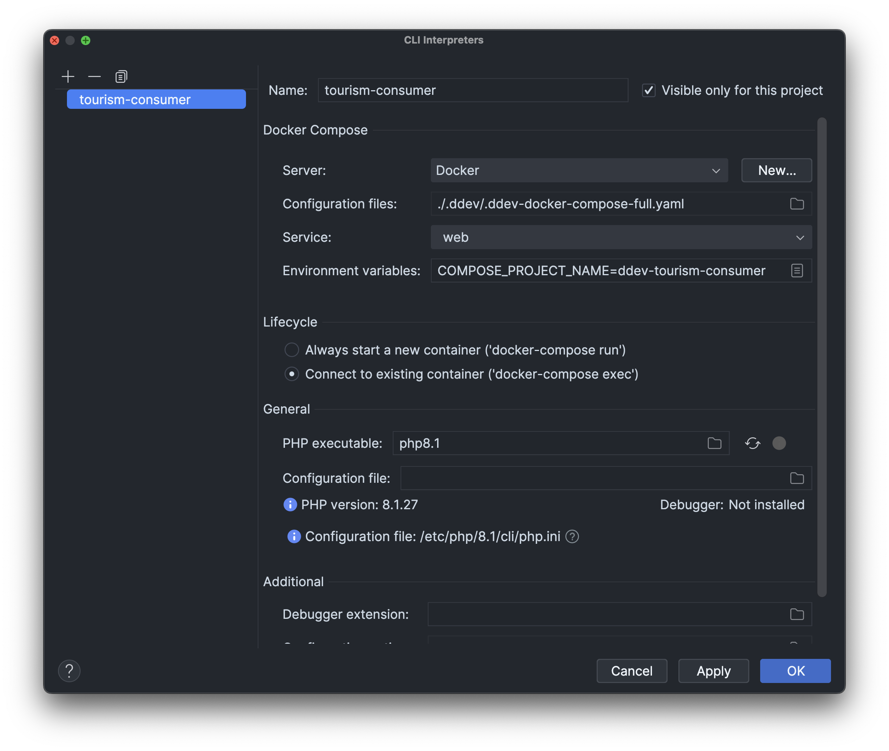
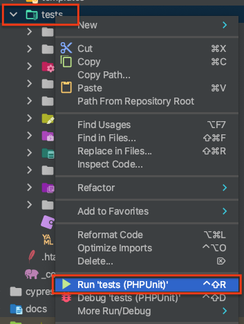
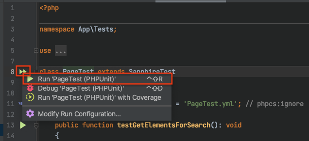
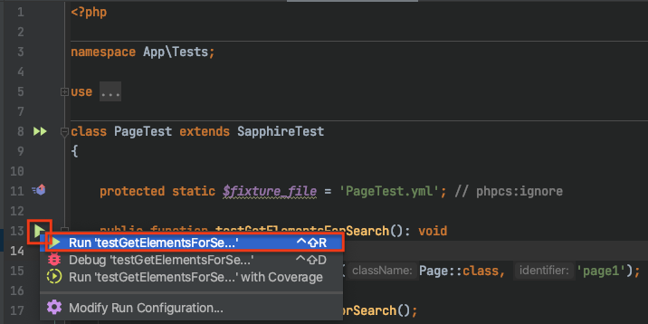

# PHPStorm <!-- omit in toc -->

- [Auto imports in Page.php](#auto-imports-in-pagephp)
- [Working with `DDEV`](#working-with-ddev)
  - [Set up XDebug 🐞](#set-up-xdebug-)
  - [Running XDebug ▶️](#running-xdebug-️)
  - [Set up PHPUnit](#set-up-phpunit)
  - [Running PHPUnit](#running-phpunit)

## Auto imports in Page.php

If you're having issues with PHP Storm not auto importing classes in `Page.php`, this is because by default PHP Storm
only auto imports within namespaces. You can enable "in file scope" imports by going to:

* Preferences/Settings > Editor > General > Auto Import > PHP
* Tick the box for "Enable auto-import in file scope"

## Working with `DDEV`
Please follow the excellent docs from ddev about connecting [PHPStorm with ddev](https://ddev.readthedocs.io/en/stable/users/install/phpstorm/)

### Set up XDebug 🐞

Ensure you've done the [prerequiste](https://ddev.readthedocs.io/en/stable/users/install/phpstorm/#enabling-phpunit) configurations for `DDEV`

Setting up `PHPStorm` and `Xdebug` on a `DDEV` site is just a few steps.

The `DDEV` docs have a section dedicated to this. [Debugging & Profiling](https://ddev.readthedocs.io/en/stable/users/debugging-profiling/step-debugging/)

Follow the instructions there.

Once complete you should now be good to go with [Running XDebug](#running-xdebug)

### Running XDebug ▶️

1) Add break point in your application  
    > `PageController::init()` is an easy one to choose.  
    > You can add a breakpoint simply by clicking to the left side of the line you wish to add the breakpoint to.  
    > (the [red dot] in the screenshot below).

    

2) Load the site in your browser, and it should hit your break point

    

### Set up PHPUnit

Ensure you've done the [prerequiste](https://ddev.readthedocs.io/en/stable/users/install/phpstorm/#enabling-phpunit) configurations for `DDEV`

Then follow the instructions laid out in `DDEV`'s docs for [Enabling PHPUnit](https://ddev.readthedocs.io/en/stable/users/install/phpstorm/#enabling-phpunit)

By the end your settings should look some what like this.

Settings > PHP

Settings > PHP > CLI Interpreter ... [Details]

### Running PHPUnit

You can right click on a particular folder and run all tests for that folder.

You can click on the "test" arrow next to a class declaration to run all tests that are within that class.

You can click on the "test" arrow next to a particular method to run just that single test.

Note: This does not include any `flush=1`, if you need to flush your tests, you will need to do that through CLI. I
haven't looked into whether you can get PHPStorm to append this - but, given that you wouldn't want to append it every 
time you run a test, I generally don't mind the one off request in CLI to clear the cache.
